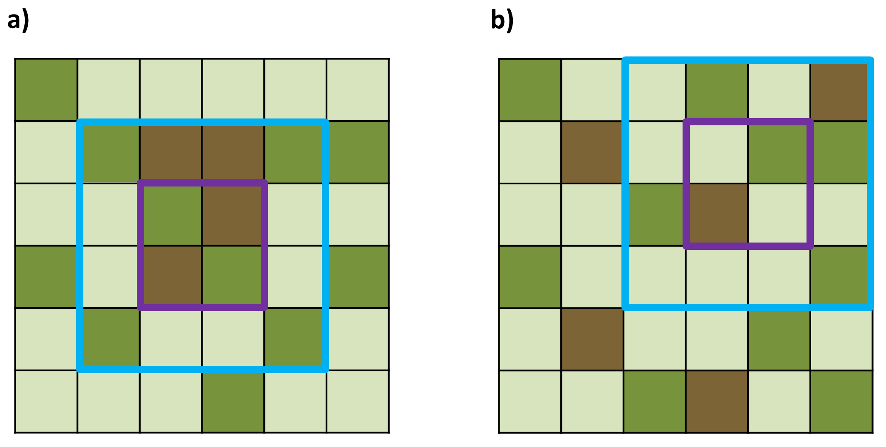

<!DOCTYPE HTML PUBLIC "-//W3C//DTD HTML 4.01//EN" "http://www.w3.org/TR/html4/strict.dtd">
<html>
<head>
  <meta HTTP-EQUIV="Content-Type" CONTENT="text/html; charset=UTF-8">
  <meta http-equiv="cache-control" content="no-cache">
  <link rel="stylesheet" type="text/css" href="default.css" />
  <title>Zadání úlohy z B4B33ALG</title>
</head>
<body><!DOCTYPE html PUBLIC "-//W3C//DTD HTML 4.01//EN" "http://www.w3.org/TR/html4/strict.dtd">
<!-- saved from url=(0111)https://cw.felk.cvut.cz/brute/data/ae/release/2019z_b4b33alg/algzima2019/evaluation/input.php?task=occultations -->
<html><head><meta http-equiv="Content-Type" content="text/html; charset=UTF-8">
  
  <meta http-equiv="cache-control" content="no-cache">
  <link rel="stylesheet" type="text/css" href="./Zadání úlohy z A4B33ALG_files/default.css">
  <title>Zadání úlohy z B4B33ALG</title>
</head>

<body>
 

<h2>Projektování přírodního parku</h2>

Projektant plánuje podobu nového přírodního parku s různými atrakcemi pro veřejnost. K realizaci potřebuje vybrat vhodnou část oblasti,
která je pro výstavbu k dispozici. Pro účely výběru má celou oblast reprezentovanou pravidelnou čtvercovou mřížkou rozměrů
<i>N</i> &times; <i>N</i>, kde jednotlivá pole jsou buď zalesněné plochy, louky nebo skály.

Park bude vybudován na čtvercové ploše <i>K</i> &times; <i>K</i> polí mřížky. Cílem je maximalizovat počet polí reprezentujících zalesněné plochy.
Zároveň projektant pracuje s podmínkou, aby se v centrální části parku nacházelo alespoň <i>S</i> polí se skalami. Centrální část má čtvercový tvar, soustředný 
s plochou parku, přičemž okraj této části je od okraje parku v dané vzdálenosti <i>L</i>. To znamená, že rozměr střední části je
(<i>K</i> &minus; 2 <i>L</i>) &times; (<i>K</i> &minus; 2 <i>L</i>).

<h3>Úloha</h3>

Pro čtvercovou mřížku <i>N</i> &times; <i>N</i> reprezentující uvažovanou oblast nalezněte optimální umístění parku.
</b>

&nbsp; 
&nbsp; <table border="0" width="800" align="center"><tbody><tr><td align="center">

<!--img style="width: 480px;" src="getdata.php?task=park&item=examples.png"--> 

<b>Obrázek 1.</b> Příklady dvou oblastí rozměrů 6 &times; 6. Světle zelená pole představují louky, tmavě zelená lesy a hnědá skály.
a) Nechť <i>K</i> = 4, <i>L</i> = 1 a <i>S</i> = 2. Hledaná optimální čtvercová plocha 4 &times; 4 je vyznačena modrým obrysem, obsahuje celkem 6 zalesněných polí.
Fialově ohraničená centrální část parku o rozměru 2 &times; 2 musí nutně obsahovat alespoň dvě pole se skalami. Tato podmínka je splněna.
b) Nyní uvažujeme, že <i>K</i> = 4, <i>L</i> = 1 a <i>S</i> = 1. Optimální řešení s pěti zalesněnými poli je znovu ohraničeno modře, centrální část park fialově. 
     </td></tr>
</tbody></table>

<h3>Vstup</h3>

Na prvním vstupním řádku jsou čtyři celá čísla <i>N</i>, <i>K</i>, <i>L</i>, <i>S</i> oddělená mezerami.
<i>N</i> je rozměr čtvercové mřížky reprezentující oblast, <i>K</i> je rozměr parku, <i>L</i> je vzdálenost okraje centrální části od okraje parku,
<i>S</i> je minimální požadovaný počet skal v cetrální části.
Následuje <i>N</i> řádků vstupu, kde <i>i</i>-tý z těchto řádků reprezentuje <i>i</i>-tý řádek čtvercové mřížky pomocí <i>N</i> celých čísel
z množiny {0, 1, 2} oddělených mezerami, přičemž číslo 0 reprezentuje pole s loukou, číslo 1 zalesněné pole a číslo 2 pole se skalami.
 
Je zaručeno, že přípustné umístění parku existuje.
 
Platí 1 &le; <i>N</i> &le; 3000; 1 &le; <i>K</i> &le; <i>N</i>; 0 &le; 2 <i>L</i> &lt; <i>K</i>; 1 &le; <i>S</i> &le; 15000.

 <h3>Výstup</h3>

Výstup sestává z jednoho textového řádku, který obsahuje číslo, jež je rovno maximálnímu počtu zalesněných polí v přípustném umístění parku.

<h3>Příklad 1</h3>

<b>Vstup</b> 
<pre>
6 4 1 2 
1 0 0 0 0 0
0 1 2 2 1 1
0 0 1 2 0 0
1 0 2 1 0 1
0 1 0 0 1 0
0 0 0 1 0 0
</pre>

<b>Výstup</b> 
<pre>
6
</pre>

Data a řešení Příkladu 1 jsou vizualizována na <b>Obrázku</b> 1a).
 

<h3>Příklad 2</h3>
<b>Vstup</b> 
<pre>
6 4 1 1 
1 0 0 1 0 2
0 2 0 0 1 1
0 0 1 2 0 0
1 0 0 0 0 1
0 2 0 0 1 0
0 0 1 2 0 1
</pre>

<b>Výstup</b> 
<pre>
5
</pre>

Data a řešení Příkladu 2 jsou vizualizována na <b>Obrázku</b> 1b).

<h3>Veřejná data</h3>

Veřejná data k&nbsp;úloze jsou k&nbsp;dispozici. Veřejná data jsou uložena také v&nbsp;odevzdávacím systému a při
každém odevzdání/spuštění úlohy dostává řešitel kompletní výstup na stdout a stderr ze svého programu
pro každý soubor veřejných dat. 
 
<a href="getdata.php?task=park&amp;item=datapub.zip"><b>Veřejná data</b></a>

</body></html></body>
</html>
