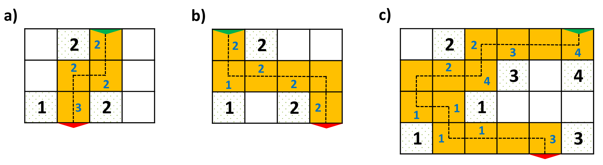

<!DOCTYPE HTML PUBLIC "-//W3C//DTD HTML 4.01//EN" "http://www.w3.org/TR/html4/strict.dtd">
<html>
  <head>
    <meta HTTP-EQUIV="Content-Type" CONTENT="text/html; charset=utf8">
    <meta http-equiv="cache-control" content="no-cache">
    <link rel="stylesheet" type="text/css" href="default.css" />
    <title>Zadání úlohy z B4B33ALG</title>
  </head>
  <body>
    <!DOCTYPE html PUBLIC "-//W3C//DTD HTML 4.01//EN" "http://www.w3.org/TR/html4/strict.dtd">
    <!-- saved from url=(0111)https://cw.felk.cvut.cz/brute/data/ae/release/2019z_b4b33alg/algzima2019/evaluation/input.php?task=occultations -->
    <html>
      <head>
        <meta http-equiv="Content-Type" content="text/html; charset=UTF-8">
        <meta http-equiv="cache-control" content="no-cache">
        <link rel="stylesheet" type="text/css" href="./Zadání úlohy z A4B33ALG_files/default.css">
        <title>Zadání úlohy z B4B33ALG</title>
      </head>
      <body>
        

          <h2>Procházka botanickou zahradou</h2>
          

            Vedení nové botanické zahrady pracuje na jejím zpřístupnění veřejnosti. Pro návštěvníky je potřeba vybudovat vchod, jednosměrnou cestu zahradou a východ.
            Pro účely nalezení optimálního řešení je zahrada reprezentovaná čtvercovou mřížkou o <i>M</i> řádcích a <i>N</i> sloupcích,
            kde jednotlivá pole obsahují buď nějaké exponáty (záhony s rostlinami, stromy),
            anebo jsou pouze zatravněná. Každý exponát je ohodnocen celým kladným číslem, které vyjadřuje jeho atraktivitu.
            Přípustná cesta zahradou je definovaná následovně:
          <ul>
            <li>
              Je to posloupnost navzájem různých zatravněných polí (nevede přes žádné pole s exponáty). Každá dvě sousední pole cesty mají společnou jednu stranu.
              Cesta začíná na poli prvního (tj., horního) řádku mřížky a končí na poli posledního (tj., dolního) řádku.
            </li>
            <li>
              Do každého řádku mřížky cesta vstoupí právě jednou z řádku předchozího, nebo z vchodu do zahrady, poté pokračuje na daném řádku buď vpravo, anebo vlevo
              přes libovolný počet polí. Nakonec cesta sestoupí do řádku následujícího, nebo skončí u východu ze zahrady. Znamená to, že cesta v mřížce nikdy nepokračuje směrem nahoru.
            </li>
            <li>
              Formálně, pro <i>i</i>=1,...,<i>M</i>, nechť <i>S</i><i>i</i> je pole, ve kterém cesta vstupuje do <i>i</i>-tého řádku, a 
              <i>T</i><i>i</i> je pole, ve kterém cesta vystupuje z <i>i</i>-tého řádku.
              Pole <i>T</i><i>i</i> může být od <i>S</i><i>i</i> jak vlevo, tak vpravo, případně může platit
              <i>S</i><i>i</i>=<i>T</i><i>i</i>.
            </li>
            <li>
              Vchod do zahrady odpovídá horní straně pole <i>S</i><i>1</i>, východ odpovídá dolní straně pole <i>T</i><i>M</i>.
            </li>
            <li>
              Pro <i>i</i>=1,...,<i>M</i>&minus;1 platí, že <i>S</i><i>i</i>+1 se nachází pod polem <i>T</i><i>i</i>,
              což odpovídá faktu, že z <i>T</i><i>i</i> cesta pokračuje do <i>S</i><i>i</i>+1.
            </li>
          </ul>
          Atraktivita zatravněného pole je definovaná jako součet atraktivit exponátů v sousedních polích (vlevo, vpravo, nahoře, dole, pokud tato pole existují).
          To odpovídá představě, že z daného pole cesty si návštěvníci mohou důkladně prohlédnout exponáty v sousedství.
          Atraktivita cesty je definovaná jako součet atraktivit všech jejích polí. Znamená to, že jeden exponát může přispět k atraktivitě cesty vícekrát, pokud
          je pozorován z více polí, tedy z různých stran.
          Cesta je optimální, pokud je přípustná a její atraktivita je mezi všemi přípustnými cestami maximální. Všimněme si, že cesta nemusí nutně navštívit všechny
          exponáty v zahradě.
          

          <h3>Úloha</h3>
          

            Pro danou čtvercovou mřížku ohodnocenou atraktivitami exponátů nalezněte optimální cestu, která má mezi všemi optimálními cestami minimální délku.
            &nbsp; 
            &nbsp; 
            &nbsp; 
          <table border="0" width="800" align="center">
            <tbody>
              <tr>
                <td align="center">
                  <!--img style="width: 660px;" src="getdata.php?task=garden&item=example.png"-->
                  
                   
                  <b>Obrázek 1.</b> Schémata zachycující reprezentaci botanické zahrady čtvercovou mřížkou. Exponáty jsou v polích s černými čísly, která udávají atraktivitu.
                  Oranžová pole vyznačují optimální cestu, vchod je zvýrazněn zeleně, východ červeně. Modrá čísla označují atraktivitu polí uvedené cesty
                  (pokud toto číslo chybí, je atraktivita příslušného pole nulová).
                  a) Příklad nejkratší optimální cesty v mřížce rozměrů 3 &times; 4. Atraktivita této cesty je 9. b) Ukázka další optimální cesty pro zahradu z předchozího případu,
                  tentokrát však délky 6. c) Optimální cesta s atraktivitou 22 v mřížce rozměrů 4 &times; 6.
                </td>
              </tr>
            </tbody>
          </table>
          

          <h3>Vstup</h3>
          

            První řádek vstupu obsahuje celá čísla <i>M</i>, <i>N</i> oddělená mezerou. Tato čísla odpovídají počtu řádků a sloupců čtvercové mřížky reprezentující
            zahradu.
            Následuje <i>M</i> řádků vstupu, kde každý <i>i</i>-tý řádek obsahuje <i>N</i> celých nezáporných čísel, přičemž <i>j</i>-té číslo určuje obsah pole
            v <i>i</i>-tém řádku a <i>j</i>-tém sloupci mřížky. Pokud je toto číslo rovno 0, pak příslušné pole reprezentuje zatravněnou plochu, pokud je kladné,
            pak reprezentuje atraktivitu exponátů, které se na daném poli nacházejí.
             
            Platí 1 &le; <i>M</i>, <i>N</i> &le; 104, <i>M</i> &times; <i>N</i> &le; 107.
            Atraktivita každého pole s exponánty není větší než 200. Je zaručeno, že pro každý vstup existuje alespoň jedna přípustná cesta.
          

          <h3>Výstup</h3>
          

            Výstup obsahuje jeden textový řádek s celými čísly <i>A</i>, <i>D</i> oddělenými mezerou, kde
            <i>A</i> je atraktivita optimální cesty a <i>D</i> je délka nejkratší optimální cesty.
          

          <h3>Příklad 1</h3>
          <b>Vstup</b> 
          <pre>
3 4
0 2 0 0
0 0 0 0
1 0 2 0
</pre>
          <b>Výstup</b> 
          <pre>
9 4
</pre>
          Data a řešení Příkladu 1 můžeme vidět na <b>Obrázku 1 a)</b>.
           
          <h3>Příklad 2</h3>
          <b>Vstup</b> 
          <pre>
4 6
0 2 0 0 0 0
0 0 0 3 0 4
0 0 1 0 0 0
1 0 0 0 0 3
</pre>
          <b>Výstup</b> 
          <pre>
22 13
</pre>
          Data a řešení Příkladu 2 můžeme vidět na <b>Obrázku 1 c)</b>.
          

          <h3>Veřejná data</h3>
          

            Veřejná data k&nbsp;úloze jsou k&nbsp;dispozici. Veřejná data jsou uložena také v&nbsp;odevzdávacím systému a při
            každém odevzdání/spuštění úlohy dostává řešitel kompletní výstup na stdout a stderr ze svého programu
            pro každý soubor veřejných dat.
             
            <a href="getdata.php?task=garden&amp;item=datapub.zip"><b>Veřejná data</b></a>
          

        

      </body>
    </html>
  </body>
</html>

